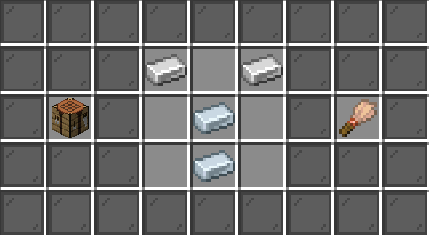
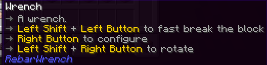

# RebarWrench
Wrench for rebar addons

## For Players & Server Owners
### Crafting
  
2 * iron ingot + 2 * tin ingot

### Usage


## For Developers
### Importing


```kotlin
dependencies {
    compileOnly("io.github.lijinhong11:RebarWrench:VERSION")
}
```
Replace the `VERSION` to the latest addon version

### Example
```java
package io.github.lijinhong11.rebarwrench;

import io.github.lijinhong11.rebarwrench.api.WrenchAction;
import io.github.lijinhong11.rebarwrench.api.WrenchResult;
import io.github.lijinhong11.rebarwrench.api.Wrenchable;
import io.github.pylonmc.rebar.block.RebarBlock;
import io.github.pylonmc.rebar.block.base.RebarInteractBlock;
import io.github.pylonmc.rebar.block.context.BlockCreateContext;
import net.kyori.adventure.text.Component;
import net.kyori.adventure.text.format.NamedTextColor;
import org.bukkit.Material;
import org.bukkit.NamespacedKey;
import org.bukkit.block.Block;
import org.bukkit.event.EventPriority;
import org.bukkit.event.player.PlayerInteractEvent;
import org.bukkit.persistence.PersistentDataContainer;
import org.bukkit.persistence.PersistentDataType;
import org.jspecify.annotations.NonNull;

public class TestMachine extends RebarBlock implements RebarInteractBlock {
    private final NamespacedKey INT = new NamespacedKey(PLUGIN_INSTANCE, "ivalue");
    private int colorIndex = 0;
    private int value = 0;
    private final NamedTextColor[] COLORS = {NamedTextColor.BLUE, NamedTextColor.GREEN};

    public static final Wrenchable WRENCHABLE = Wrenchable.builder()
            .interactFunction((Player player, RebarBlock block, WrenchAction action) -> {
                TestMachine machine = (TestMachine) block;
                return switch (action) {
                    case CONFIGURE -> {
                        machine.colorIndex = (machine.colorIndex + 1) % machine.COLORS.length;
                        player.sendActionBar(Component.text("Color: " + machine.COLORS[machine.colorIndex].toString()));
                        yield WrenchResult.SUCCESS;
                    }
                    case ROTATE -> {
                        machine.value = (machine.value + 1) % 6;
                        player.sendActionBar(Component.text("Value: " + machine.value));
                        yield WrenchResult.SUCCESS;
                    }
                    case FAST_BREAK -> WrenchResult.SUCCESS;
                };
            })
            .build();

    public TestMachine(@NonNull Block block, @NonNull BlockCreateContext context) {
        super(block, context);
    }

    public TestMachine(@NonNull Block block, @NonNull PersistentDataContainer pdc) {
        super(block, pdc);
    }

    @Override
    public void onInteract(@NonNull PlayerInteractEvent e, @NonNull EventPriority priority) {
        if (!e.getAction().isRightClick()) return;
        e.getPlayer().sendMessage("The int value is " + value);
    }

    @Override
    public void write(@NonNull PersistentDataContainer pdc) {
        pdc.set(INT, PersistentDataType.INTEGER, value);
    }
}

//Now to register the Wrenchable object
RebarWrench.registerWrenchable(TestMachine.class, TestMachine.WRENCHABLE);
```
